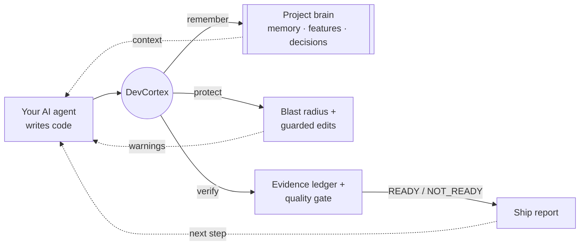
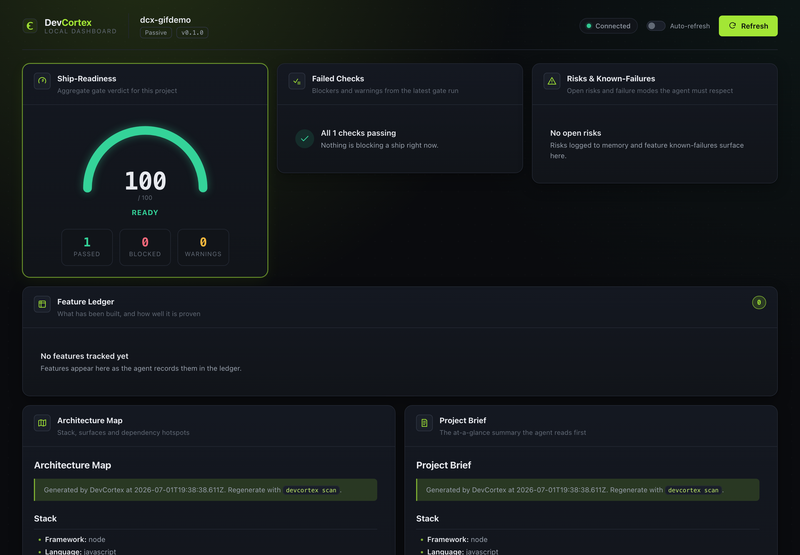

<div align="center">

# DevCortex

**Your AI agent said "done." DevCortex proves whether it actually shipped.**

Evidence-backed **ship reports**, an **evidence ledger** that blocks unproven "done,"
and persistent **project memory** — for Claude Code, Codex, Cursor, VS Code agent
mode, and any MCP client.

[](https://github.com/asiflow/DevCortex/actions/workflows/ci.yml)
[](https://www.npmjs.com/package/@asiflow/devcortex)
[](./LICENSE)
[](#quality)

<br/>


</div>

---

## Your agent said "done." Did it actually work?

AI coding agents generate impressive code — then hallucinate "done" without proof.
DevCortex runs the gate. Same command, before and after:

**Before** — the agent "fixed" the tax bug and declared it done:

```console
$ devcortex ship
CORTEX SHIP STATUS
────────────────────────────────────────────────────────
Status       NOT_READY

Blocked (1)
  ✗ test — Command exited with code 1

Unproven "done" is blocked
  ✗ Required check failed: test — Command exited with code 1
```

**After** — you fix the root cause and ship for real:

```console
$ devcortex ship
CORTEX SHIP STATUS
────────────────────────────────────────────────────────
Status       READY

Passed (1)
  ✓ test — Command exited 0
```

The difference is **evidence**. `devcortex ship` exits non-zero on `NOT_READY`, so it
drops straight into CI, pre-commit, and your agent's "am I done?" check.

## How it works

DevCortex is **not another AI coding agent**. It's a local-first layer that sits
*between you and the agent you already use*, running a tight
**remember → protect → verify → ship** loop:



- **Remember** — a durable `.cortex/` brain (memory, feature, and decision ledgers)
  so the agent stops forgetting what it built, why, and what not to break.
- **Protect** — `devcortex preflight "<task>"` shows what a change touches (auth,
  billing, routes, data) *before* you write it; guarded mode blocks edits to
  protected paths with an explanation, never silently.
- **Verify** — the evidence ledger refuses to let the agent claim "done" until the
  repo's *own* gates (typecheck / lint / build / test) actually pass.
- **Ship** — a single evidence-backed verdict you (and CI) can trust.
- **Brief & distill** — `devcortex brief` injects a ≤2KB evidence-backed project
  brief at Claude Code session start; `devcortex distill` turns the transcript into
  run records and observed project memory at session end — both wired automatically
  by `devcortex install claude`.

Deep cognition happens **locally and outside your agent's context**, so only a small,
actionable instruction comes back — it doesn't burn your tokens.

## The local dashboard

Run `devcortex dashboard` in your project — it starts a local daemon and prints a URL
to open in your browser (default `http://127.0.0.1:7420`):

```bash
devcortex dashboard      # starts the daemon, prints the dashboard URL
devcortex daemon stop    # stop it when you're done
```

It serves a live view of ship-readiness, failing checks, risks, the feature ledger,
and the architecture map — all on `127.0.0.1`, no cloud.

<div align="center">

</div>

## Install

```bash
npm install -g @asiflow/devcortex        # installs the `devcortex` command (or use npx @asiflow/devcortex)
devcortex init                           # scan the repo, create .cortex/, pick a mode
devcortex preflight "add subscription billing"   # risk + blast radius + context, up front
devcortex ship                           # evidence-backed ship report (exit 2 when NOT_READY)
```

Then wire it into your agent so the loop is automatic — **one command per host**:

```bash
devcortex install claude     # Claude Code: lifecycle hooks (preflight · guard · evidence · ship) + MCP
devcortex install codex      # Codex CLI: AGENTS.md discipline + MCP server
devcortex install cursor     # Cursor: always-apply rules + MCP server
devcortex install vscode     # VS Code agent mode: MCP + tasks
devcortex install github     # GitHub Actions: PR checks that enforce the ship gate
devcortex install --all      # all of the above
```

Or point **any MCP client** at the stdio server (`cortex.*` tools) — zero install:

```json
{ "mcpServers": { "devcortex-mcp": { "command": "npx", "args": ["-y", "@asiflow/devcortex-mcp"] } } }
```

📖 **Full setup for every host — [docs/integrations.md](./docs/integrations.md)** —
what each command writes, what the hooks do, and how to get the MCP server.

## Try it in 30 seconds

```bash
git clone https://github.com/asiflow/DevCortex && cd DevCortex
pnpm install && pnpm -r build
bash demo/demo.sh                        # the live NOT_READY → READY demo above
```

See [`docs/getting-started.md`](./docs/getting-started.md) for the full loop run
end-to-end against the bundled `fixtures/sample-next-app`.

## What works now vs. what's planned

See **[ROADMAP.md](./ROADMAP.md)** — it separates the shipping Core (this repo) from
the deeper gates, learning loop, and the paid Premium Brain / hosted Cloud tiers.
DevCortex is built **production-grade from day one** — no MVP placeholders.

## Quality

Strict TypeScript · **829 tests passing** · pnpm + turborepo monorepo. Every push is
gated by CI (build · typecheck · lint · test). The `devcortex` CLI publishes as a
self-contained npm bundle.

## Security & trust model

DevCortex reads files and **runs commands inside the repository you point it at** —
treat it like any tool with shell access to that repo:

- **Run DevCortex only on repositories you trust.** The quality gate (`verify` /
  `ship`) runs the *target repo's own configured commands* — its `typecheck` /
  `lint` / `build` / `test` scripts. Both spawn real processes, so a hostile repo's
  scripts are hostile code.
- **Verifiers are read-only and root-contained.** The file / route / symbol / import
  verifiers never write, and any path that escapes the project root (`../` traversal
  or an absolute path outside the root) is refused without being read.
- **Guarded mode protects your `protectedPaths`.** Edits to high-risk or
  `protectedPaths`-matched files (`**/auth/**`, `middleware.ts`, `.env*`, migrations)
  are blocked *with an explanation* — never silently.

## License

[Apache-2.0](./LICENSE). Contributions of stack packs, skills, workflows, quality
gates, and adapters are welcome.
